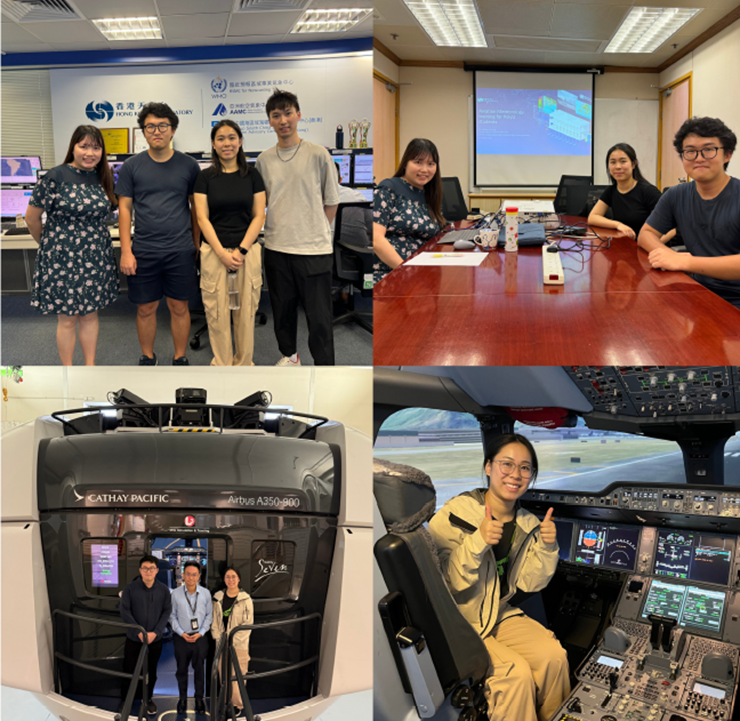
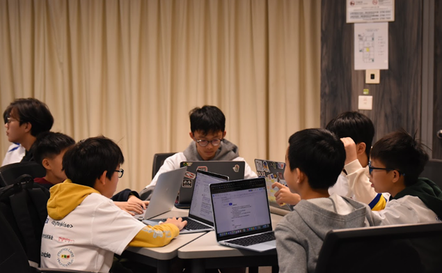
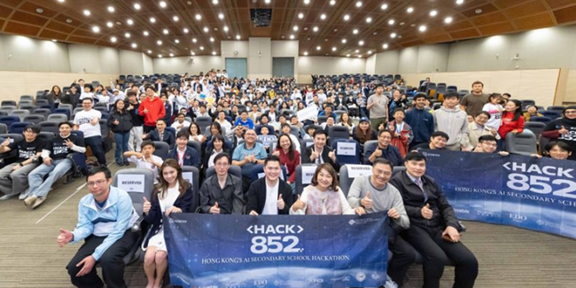

# About PolyU Industrial Center

![alt text](images/polyu industrial center.png

Students from a wide range of disciplines, including Occupational Therapy, Radiography, Physiotherapy, Computing & AI, Land Surveying, Applied Social Sciences, Fashion & Textiles, Chinese History & Culture, Biotechnology, Food Safety & Technology, Hotel & Tourism Management, and Building & Real Estate, etc, have participated in the experiential learning activities. Following these activities, students are required to submit a reflection report that connects their theoretical learning with real-world contexts and relates AI to their own disciplines and future professional roles. Here are some examples of student reflections:

# Project-based learning with Agentic coding platforms

 We integrate software development projects that make purposeful use of AI from ideation to prototyping. Students are introduced to foundational knowledge, including version control with Git, as well as emerging skills such as prompt engineering and context engineering for agentic coding. We also invite industry practitioners to share emerging trends related to the use of AI in software development. 

Video: A sharing session on the topic Agentic Coding in 2026 for PolyU students: 

https://www.youtube.com/watch?v=r_YQUC0LQvI

# Capstone project with industrial collaborators and real-world problems

We also integrate industry-based capstone projects, through which students engage with real stakeholders in authentic professional settings. A notable example is our aviation collaboration with the Hong Kong Observatory, Cathay Pacific, and the Hong Kong Youth Aviation Academy, in which students developed an interactive weather-visualisation platform and explored machine learning models for predicting go-around risks during landing. Such projects require students to integrate technical knowledge with domain understanding, stakeholder communication, teamwork, and solution design under real-world constraints. 
We also engage in outreach and talent development. 

The project involved collaboration with multiple stakeholders: the Hong Kong Observatory (HKO) provided authoritative meteorological data, while Cathay Pacific (CX) offered valuable operational insights to ensure the system aligns with real-world cockpit needs. In addition, the Hong Kong Youth Aviation Academy (HKYAA) facilitated a series of professional training sessions, including hands-on workshops and flight simulation experiences, which deepened students’ understanding of aviation procedures and pilot workflows. Through this immersive, industry-connected learning experience, participants gained both technical and contextual knowledge, allowing them to apply AI tools meaningfully in a high-stakes, domain-specific setting.

The outcome includes an interactive platform that visualizes complex meteorological data, such as wind shear, turbulence, and wind profiles, through an intuitive and user-friendly interface. By leveraging data from the Hong Kong Observatory and tools like Pydeck, the system enables pilots to access critical weather information in a cognitively efficient, hands-free format. In advisualizationplementary machine learning model was developed to predict the possibilities of go-around during landing period, offering a proactive layer of risk assessment. The integration of visualization with predictive analytics showcases the synergy of AI and data science in solving high-stakes problems.

REAL-WORLD EXPOSURE
- Training session by Hong Kong Youth Aviation Association (HKYAA)
- Meteorological equipment visit in Hong Kong Observatory (HKO)
- Cathay Pacific (CX) visit and A350 flight simulator try-out

# Hackathons for high school students
In Mar 2026,we co-organize a one-day high school hackathon. The event brought together more than 170 secondary school student participants from primary and secondary schools, together with parents and experts from academia and industry, and was designed to lower barriers to technology participation by welcoming students of all coding backgrounds.In the AI Track, teams transformed their ideas into real working projects with AI tools, supported by mentors and on-site workshops These hackathon experiences mirror the principles of authentic project-based learning: students learn through challenge, experimentation, collaboration, and rapid iteration.

Link to the event: https://www.polyu.edu.hk/comp/news-and-events/news/2026/0318_hack852
 

# GPTutor and Virtual patient simulation sharing

A video recording of the sharing session on our GenAI-powered learning platform and the use of virtual patient simulation for optometry students: 
https://www.youtube.com/watch?v=Uih2wjuIEjk